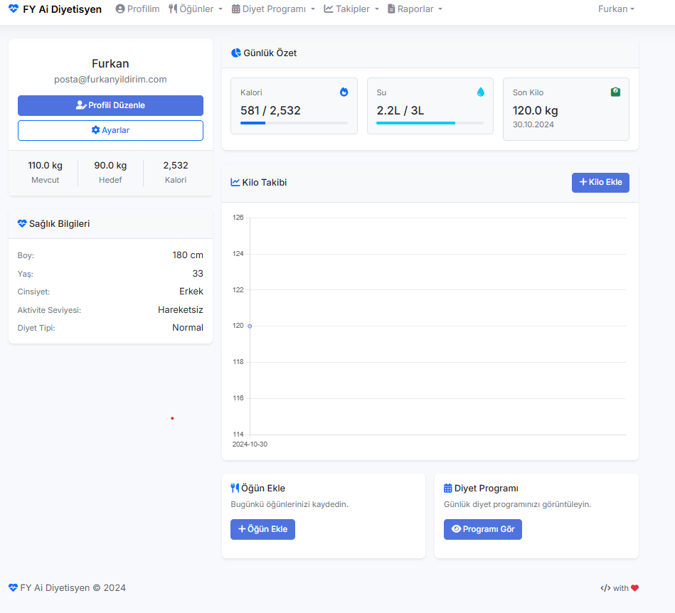
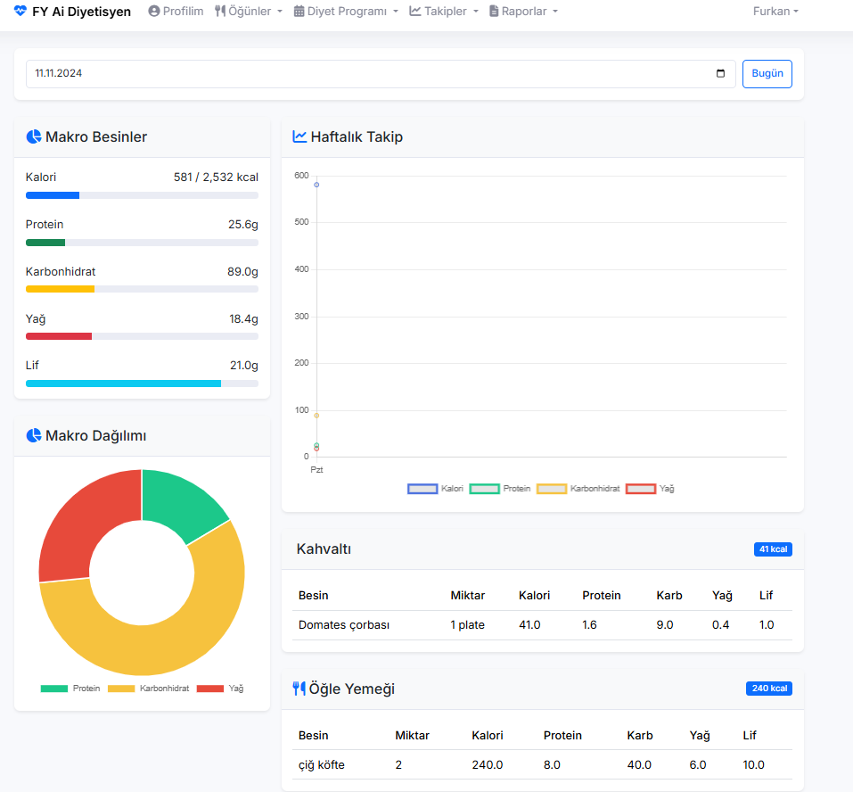
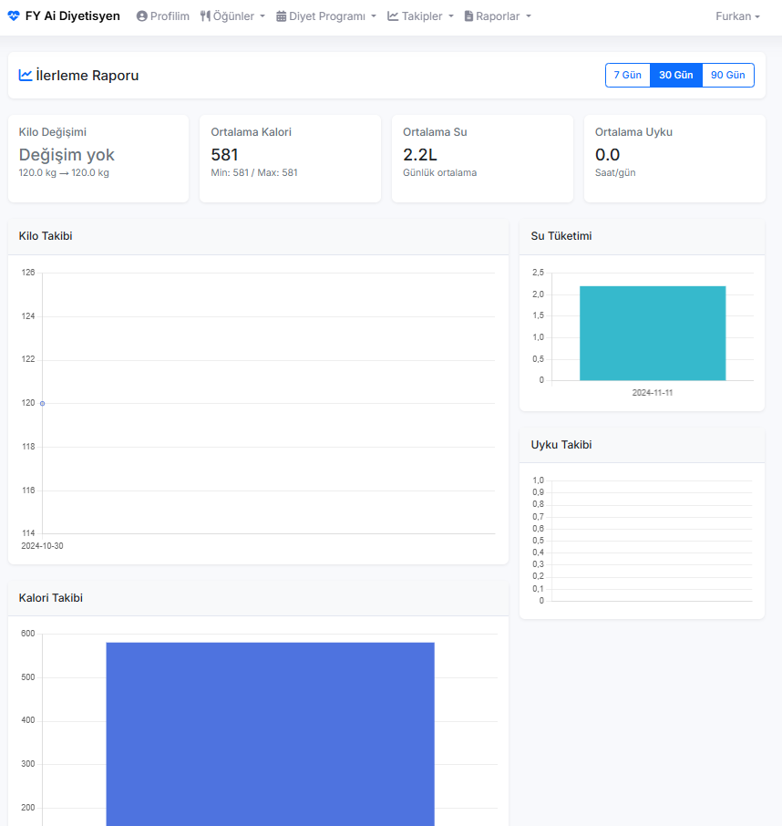
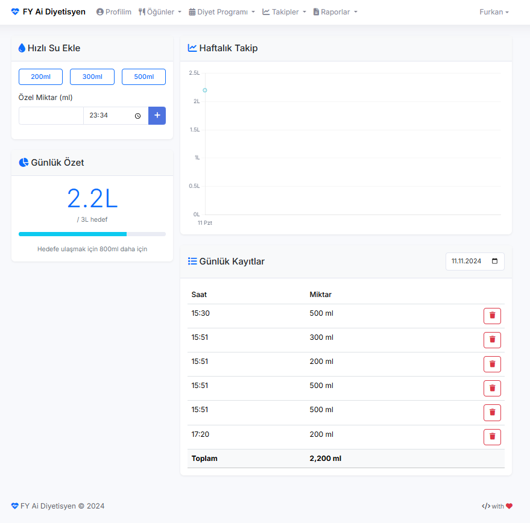

# Sağlıklı Yaşam Asistanı / Healthy Life Assistant

📸 Screenshots/Ekran Görüntüleri
<table>
<tr>
<td></td>
<td></td>
<td></td>
<td></td>
</tr>
</table>

[English](#english) | [Türkçe](#turkish)

## Turkish

### 📱 Sağlıklı Yaşam Asistanı

Yapay zeka destekli, kişiselleştirilmiş diyet ve sağlıklı yaşam takip sistemi.

### 🚀 Özellikler

- **Kişiselleştirilmiş Diyet Programları**
  - Günlük, haftalık ve aylık diyet planları
  - Yapay zeka ile özelleştirilmiş menüler
  - Türk mutfağına uygun öneriler

- **Detaylı Besin Takibi**
  - Kalori hesaplama
  - Makro besin takibi (protein, karbonhidrat, yağ)
  - Öğün bazlı kayıt

- **Kapsamlı Takip Sistemi**
  - Kilo takibi
  - Su tüketimi
  - Uyku düzeni
  - İlerleme grafikleri

- **Sağlık Odaklı**
  - Özel diyet tipleri (vejetaryen, vegan, glutensiz)
  - Sağlık durumu bazlı öneriler
  - Besin değeri analizleri

### 🛠️ Teknolojiler

- PHP 8.0+
- MySQL
- Bootstrap 5
- OpenAI API
- Chart.js
- Font Awesome

### ⚙️ Kurulum

1. Projeyi klonlayın:
```bash
git clone https://github.com/fyildirim-debug/diet-app.git
```

2. Veritabanını oluşturun:
- `database.sql` dosyasını MySQL'de çalıştırın

3. Konfigürasyon:
- `config/config.php` dosyasını düzenleyin
- OpenAI API anahtarınızı ekleyin
- Veritabanı bilgilerini güncelleyin

4. Web sunucusunda çalıştırın:
- Apache/Nginx
- PHP 8.0+
- MySQL 5.7+

### 🎯 Gelecek Güncellemeler

- [ ] Buglar Temizlenecek
- [ ] Çoklu Dil Seçeneği
- [ ] Spor ve Etkinlik Tavsiyeleri
- [ ] Besin Görselleri

### 👨‍💻 Geliştirici

- **Furkan YILDIRIM**
- Website: [furkanyildirim.com](https://furkanyildirim.com)
- GitHub: [@fyildirim-debug](https://github.com/fyildirim-debug)
- Email: posta@furkanyildirim.com

### 📝 Lisans

Bu proje MIT lisansı altında lisanslanmıştır. Detaylar için [LICENSE](LICENSE) dosyasına bakınız.

---

## English

### 📱 Healthy Life Assistant

AI-powered, personalized diet and healthy lifestyle tracking system.

### 🚀 Features

- **Personalized Diet Programs**
  - Daily, weekly and monthly diet plans
  - AI-customized menus
  - Turkish cuisine compatible suggestions

- **Detailed Nutrition Tracking**
  - Calorie calculation
  - Macro nutrient tracking (protein, carbs, fat)
  - Meal-based logging

- **Comprehensive Tracking System**
  - Weight tracking
  - Water consumption
  - Sleep patterns
  - Progress charts

- **Health Focused**
  - Special diet types (vegetarian, vegan, gluten-free)
  - Health condition based recommendations
  - Nutritional value analysis

### 🛠️ Technologies

- PHP 8.0+
- MySQL
- Bootstrap 5
- OpenAI API
- Chart.js
- Font Awesome

### ⚙️ Installation

1. Clone the project:
```bash
git clone https://github.com/fyildirim-debug/diet-app.git
```

2. Create database:
- Run `database.sql` in MySQL

3. Configuration:
- Edit `config/config.php`
- Add your OpenAI API key
- Update database credentials

4. Run on web server:
- Apache/Nginx
- PHP 8.0+
- MySQL 5.7+

### 🎯 Upcoming Updates

- [ ] Bug Fixes
- [ ] Multi-Language Support
- [ ] Sports and Activity Recommendations
- [ ] Food Images

### 👨‍💻 Developer

- **Furkan YILDIRIM**
- Website: [furkanyildirim.com](https://furkanyildirim.com)
- GitHub: [@fyildirim-debug](https://github.com/fyildirim-debug)
- Email: posta@furkanyildirim.com

### 📝 License

This project is licensed under the MIT License - see the [LICENSE](LICENSE) file for details.


